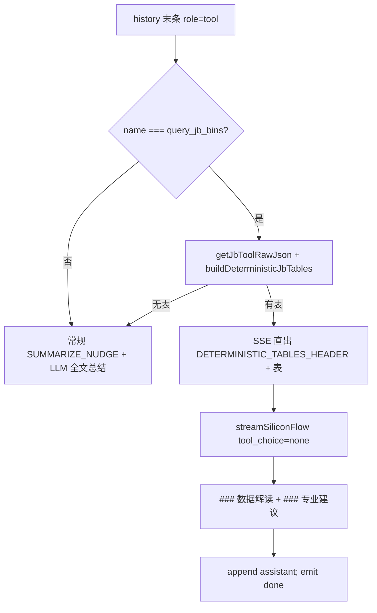

# Claude Code 交接：Agent JB 确定性总结 + 工程专业建议

**日期：** 2026-05-30  
**分支：** `report-refactor`（合并前以实际分支为准）  
**读者：** Claude Code / Cursor Agent 接手 **AI Agent 生产准确度** 时优先阅读。  
**前置阅读：** [`HANDOFF_AGENT_JB_BIN_AND_TOOL_RESULT.md`](HANDOFF_AGENT_JB_BIN_AND_TOOL_RESULT.md)、[`HANDOFF_JB_INTERRUPT_YIELD.md`](HANDOFF_JB_INTERRUPT_YIELD.md)、[`HANDOFF_AGENT_JB_PROBE_CARD_CHANGE.md`](HANDOFF_AGENT_JB_PROBE_CARD_CHANGE.md)

---

## 0. 术语（对用户 / Agent 回复用词）

| API / 库字段 | 同义 | **对用户、解读、专业建议优先用词** |
| --- | --- | --- |
| JB `slot`、Yield `wafer`、INF `r_1-{slot}` | **waferId**（晶圆片序号） | **waferId** 或「第 N 片 wafer」；`slot` 仅出现在工具参数、JSON、表头 |
| INF `dut`、map **site** | 探针卡测试触点 | **DUT**；避免写「site N」（口语易与机台 site 混淆） |

- 代码与 Oracle 列名**不变**（仍为 `SLOT`、`dut` 等）。
- Agent 系统提示：`agentPrompt.ts` 顶部「术语」节；确定性解读：`BRIEF_COMMENTARY_SYSTEM`（`agentJbDeterministicReply.ts`）。

**测试层用词：**

| 用户输入 | passId | 回复 / 服务端表头 |
| --- | --- | --- |
| 常温 / sort1 / pass1 | 1 | **pass1** |
| 高温 / sort2 / pass3 | 3 | **pass3** |
| 低温 / sort3 / pass5 | 5 | **pass5** |

- `jbYieldCalc.passIdSortLabel` → markdown 列名为 `pass1`/`pass3`/`pass5`（无「常温/高温/低温」）。
- LLM 结论、数据解读、专业建议**禁止**写常温/高温/低温（用户原文引用除外）。

---

## 1. 背景与症状

用户反馈 Agent 在 **lot 概况 / BIN 趋势 / INTERRUPT 半片** 场景下：

| 症状 | 根因 |
| --- | --- |
| 只报 pass3 良率、称「无 pass1」 | `limit:200` + `TESTEND DESC` 截掉较早 pass1 行；或默认 1 年窗 |
| 合并 pass3+pass5 报「整体 99.93%」 | 总结轮 LLM 自行平均，未用 `yieldByPassId` |
| INTERRUPT slot 只写下半片 | 模型忽略 `slotYieldInterruptMarkdown` / `badBinSlotTrends` 半片列 |
| BIN7 趋势缺 slot1 pass1 | 同上截断 + 历史压缩丢 `badBinSlotTrends` |
| 数字与表不一致 | 总结轮 LLM 改写预计算 markdown，而非直出服务端表 |

**目标：** 总结轮 **数字由服务端 markdown 直出**；LLM **仅**写「数据解读 + Wafer Test / Probe Card / DUT 维护」简短专业建议。

---

## 2. 架构（总结轮两条路径）



| 路径 | 触发 | 数字来源 |
| --- | --- | --- |
| **确定性（优先）** | 末工具 `query_jb_bins` 且 `buildDeterministicJbTables` 非空 | 服务端 `lotYieldOverviewMarkdown` / `badBinSlotTrends[].markdown` |
| **常规总结** | 其它工具或无法选表 | `SUMMARIZE_NUDGE` 要求用 `passIdsPresent`、`badBinSlotTrends` 等字段；仍可能 paraphrase |

**入口：** `agentLoop.ts` → `tryRunDeterministicJbSummary`（`historyAwaitingToolSummary` 分支内）。

---

## 3. Lot 全量查询（Oracle + Dummy 同步）

**文件：** `agentToolHandlers.ts`

当 `query_jb_bins` 带 **`lot`**：

1. 无时间参数时自动 **`testEndFrom: "2020-01-01"`**（绕过默认 1 年 `v3DefaultOneYearWindow`）。
2. Oracle：**`buildInfcontrolLayerBinsV3SqlFullMatching`**（无 `FETCH FIRST`），返回该 lot 全部匹配行。
3. 回传 **`lotQueryFullRows: true`** + `_lotQueryGuide`（见 `agentJbBinFormat.ts`）。
4. Dummy：同 lot 过滤逻辑须在 `infcontrolLayerBinsDummy` 路径保持 parity（`jbAgentLotQuery.test.ts`）。

**禁止：** 对 lot 概况仍用 `limit:200` 指望 `rows` 含全 sort。

---

## 4. 预计算字段（`wrapJbQueryResultForAgent`）

**文件：** `agentJbBinFormat.ts`、`jbYieldCalc.ts`、`agentJbBinTrend.ts`、`agentJbHistoryCompact.ts`

| 字段 | 用途 |
| --- | --- |
| **`passIdsPresent`** | 本 lot 实测出现的 passId（1/3/5）；禁止臆造「无 sort1」 |
| **`yieldByPassId` / `yieldByPassIdMarkdown`** | 分 sort 良率；禁止合并为单一 overall |
| **`lotYieldOverviewMarkdown`** | lot 概况表（确定性 `lot_overview` 模式） |
| **`slotYieldInterruptMarkdown`** | 有 INTERRUPT：前半→后半→整片合并（0% 必写）；再 lot 整体 |
| **`slotsByPassId`** | 各 passId 下有数据的 slot 列表（含 INTERRUPT） |
| **`badBinSlotTrends`** | `[{ bin, passId, markdown }]` — BIN 趋势表含整片/前半/后半 BIN 颗数与良率 |
| **`agentTablesDigest`** | `{ lotOverview, binTrends, passIdsPresent }` — 历史压缩时保留选表依据 |
| **`cardByPassIdMarkdown` / `cardChangesBySlotPass`** | 换卡规则见换卡交接文档 |

**核心字段不可丢：** `agentJbYieldCore.ts` → `jbYieldCoreFields()`；`serializeJbQueryResultForAgent` / `compactJbBinsForHistory` 优先保留。

---

## 5. 确定性选表（`agentJbDeterministicReply.ts`）

| `detectJbReplyMode` | 用户意图关键词 | 输出 |
| --- | --- | --- |
| **`bin_trend`** | BINn + 趋势/每片/1-25/颗数 | `badBinSlotTrends` 中匹配 bin；`pickPassIdForBinTrend` 解析 sort1/2/3 |
| **`lot_overview`** | 整体/概况/测试情况/重新计算 | `lotYieldOverviewMarkdown` |
| **`generic`** | 其它 | 优先 overview，否则匹配 bin 趋势 |

**会话缓存：** `agentJbSessionCache.ts` — `storeJbToolRawJson` / `getJbToolRawJson` 保存完整工具 JSON（总结轮选表 + fallback）。

---

## 6. LLM 解读与专业建议

**System：** `BRIEF_COMMENTARY_SYSTEM`（同文件）

**User：** `buildBriefCommentaryUserMessage(question, tables, { engineeringContext, yieldMonitorNote })`

**输出两节（不要再包一层 `### 简要解读`）：**

```markdown
### 数据解读
（3–5 句，仅解读表内数字）

### 专业建议
1. **晶圆测试（Wafer Test）** …
2. **探针卡（Probe Card）** …
3. **DUT 维护**（= map site，对用户不写 site）…
```

**工程上下文：** `buildEngineeringContextFromPayload` — passId、换卡/中断 slot、testerId。  
**Yield Monitor：** 同会话若已 `query_yield_triggers`，`yieldMonitorNoteFromHistory` 注入一句。

**常规总结兜底：** `SUMMARIZE_NUDGE` 仍要求含专业建议；`jbBinsYieldFallbackMessage` 可读 cache 原始 JSON。

---

## 7. 历史体积

| 配置 | 默认 | 说明 |
| --- | --- | --- |
| **`toolResultMaxChars`** | 12000 | 单次工具回传上限（Settings） |
| **`toolResultMaxHistoryChars`** | 12000 | 写入 session 历史的上限（`agentConfig` + `runtimeConfig` + 报表 `useServerConfig.ts`） |

**`compactJbBinsForHistory`**：保留 `jbYieldCoreFields` + `agentTablesDigest`；避免 6000 硬切丢半片/BIN 趋势。

---

## 8. 源码索引

| 文件 | 职责 |
| --- | --- |
| `agentLoop.ts` | `tryRunDeterministicJbSummary`、`yieldMonitorNoteFromHistory` |
| `agentJbDeterministicReply.ts` | 选表、commentary prompt、`BRIEF_COMMENTARY_SYSTEM` |
| `agentJbSessionCache.ts` | 按 session 缓存 JB 工具原始 JSON |
| `agentJbBinFormat.ts` | wrap / serialize / `agentTablesDigest` |
| `agentJbBinTrend.ts` | `buildBadBinSlotTrends` |
| `agentJbHistoryCompact.ts` | overview / interrupt markdown |
| `agentJbYieldCore.ts` | 总结轮必读字段列表 |
| `agentToolHandlers.ts` | lot 全量 SQL + Dummy parity |
| `jbYieldCalc.ts` | `binDieByHalvesForGroup`、`sumBadBinDieOnRows` |
| `agentPrompt.ts` | passIdsPresent、禁止合并良率、BIN 趋势规则 |

**测试：**

- `test/agentJbDeterministicReply.test.ts`
- `test/agentJbBinTrend.test.ts`
- `test/agentJbHistoryCompact.test.ts`
- `test/jbAgentLotQuery.test.ts`
- `test/agentJbBinFormat.test.ts`、`test/jbYieldCalc.test.ts`

---

## 9. 验证用例

部署后 **New Chat**，Settings 确认 `toolResultMaxChars` / history 均为 **12000**。

### 9.1 Lot 概况

> WA03P02G NF12316.1X 这个 lot 整体测试情况，重新计算良率。

**期望：**

- 一次 `query_jb_bins(lot=…)`，`lotQueryFullRows: true`
- 回复先出现「以下表格由服务端…」+ 分 sort 良率表
- 后有 `### 数据解读` 与 `### 专业建议`（含 Wafer Test / Probe Card / DUT）
- **无** pass3+pass5 合并单一良率

### 9.2 BIN 趋势 + INTERRUPT

> NF12316.1X sort1 BIN7 趋势，1–25 片。

**期望：**

- `badBinSlotTrends` 表含 slot1 pass1（若库里有 INTERRUPT，表含前半/后半列）
- 有中断 slot 在解读中提及半片，专业建议可提续测/清卡/site

### 9.3 与 Yield Monitor 同轮

先问 Yield Monitor 报警，再问同 lot JB。

**期望：** 专业建议可引用「已查 Yield Monitor」；数字仍以 JB 表为准。

---

## 10. 改口径时同步

1. 预计算字段 / markdown 形状 → `agentJbBinFormat.ts`、`jbYieldCalc.ts`、`agentJbBinTrend.ts`
2. 选表逻辑 → `agentJbDeterministicReply.ts`
3. 总结轮流程 → `agentLoop.ts`
4. Prompt → `agentPrompt.ts`、`agentToolSchemas.ts`
5. 核心字段列表 → `agentJbYieldCore.ts`
6. 本文件 + 根 `CLAUDE.md` + `pcr-ai-api/CLAUDE.md` §11 新条目
7. Oracle/Dummy lot 查询 → `agentToolHandlers.ts` + Dummy 路径

---

## 11. 部署

```bash
cd pcr-ai-api
npm ci
npm test
npm run build
npm run pm2:reload

cd pcr-ai-report
npm ci
npm run build   # 或 pack:dist
```

报表：**New Chat** 清 session后再测。

### 11.1 部署后「没作用」排查

| 检查 | 期望 |
| --- | --- |
| `GET /health` | 含 **`agentJbDeterministicSummary": true`**、**`agentJbCacheVersion": 2`** |
| 总结轮首段 | 出现「**以下表格由服务端根据 JB STAR 实测数据生成**」 |
| 状态提示 | 「**正在输出服务端预计算表…**」 |
| 问题须带 **`lot`** | `query_jb_bins(lot=…)` 才会 `lotQueryFullRows` + 预计算表 |
| API 必须 **build 后 pm2 reload** | 勿只 `git pull` 不编译 `dist/` |

**根因（2026-05 修复）：** 旧版把 **serialize 截断后** 的 JSON 写入 session 缓存，大 lot 会丢掉 `lotYieldOverviewMarkdown` / `badBinSlotTrends`，`tryRunDeterministicJbSummary` 直接失败并回退纯 LLM。新版在 **`onJbBinsWrapped`** 中用 `buildJbSessionCacheJson` 在截断**之前**写入缓存。

---

## 12. 已知限制 / 后续

- 确定性路径仅当 **最后工具** 为 `query_jb_bins`；末工具为 `aggregate_*` 等仍走常规总结。
- `generate_chart` 总结仍走 `chartToolFallbackMessage`，不走 JB 确定性表。
- 若 `buildDeterministicJbTables` 返回 null（缺 digest），回退 LLM 全文总结 — 需保证 `agentTablesDigest` 在 compact 后仍存在。
- Dual-tool（Yield + JB）专业建议对 Yield 仅为一句 context，无 Yield 数字表直出。
