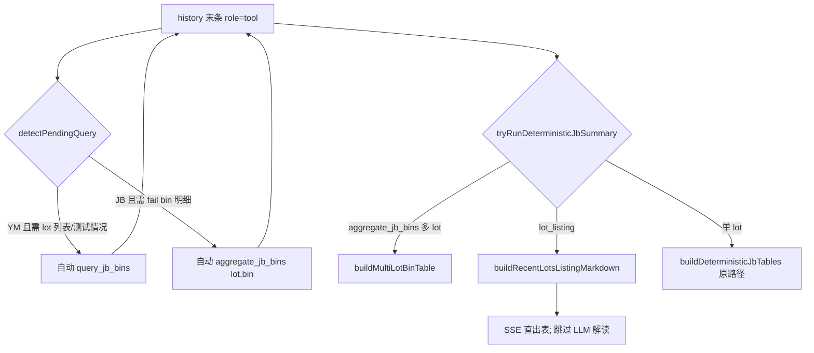

# Claude Code 交接：Agent 跨 lot 列表 + YM/JB 自动补查

**日期：** 2026-06-23  
**分支：** `feat/dynamic-prompt-injection`  
**读者：** Claude Code / Cursor Agent 接手 **device+机台 lot 枚举 / fail bin 汇总 / 嫌疑 DUT** 类问题时优先阅读。  
**前置阅读：** [`HANDOFF_AGENT_JB_DETERMINISTIC_SUMMARY.md`](HANDOFF_AGENT_JB_DETERMINISTIC_SUMMARY.md)、[`HANDOFF_JB_MULTI_LOT_MASK_YIELD.md`](HANDOFF_JB_MULTI_LOT_MASK_YIELD.md)

---

## 1. 背景与症状（2026-06-23 回归）

用户典型问法：

- `WA01P14E 在 b3uflex24 台近 3 个月测试的所有 lot 都列出来`
- `请把 32 个 lot 和主要的 failed bin、嫌疑 DUT 列出来`
- `全部列出来`

| 症状 | 根因 |
| --- | --- |
| 只输出 **NF13256.1R 单 lot 良率/BIN 警示表** | `tryRunDeterministicJbSummary` 走 `lot_overview` / `generic`，未识别 **lot 列表** 意图 |
| 只调 `query_yield_triggers` 或 `aggregate_yield_triggers`，口述「32 lot、BIN61」 | 总结轮禁止再调工具；LLM 无 JB 数据却写结论 |
| `get_filter_values(search:"uflex24")` 空，直接报「无机台」 | 未映射 `UFLEX 24` → `b3uflex24`；search 无 fallback |
| `全部列出来` 仍只有 YM 文字摘要 | 未触发 **pending query** 补 `query_jb_bins` |

**目标：** 列表类问题 **服务端直出 Markdown 表**（可含 TOP fail BIN / YM 报警 / 嫌疑 DUT）；YM-only 时 **自动补 JB**；禁止用单 lot 概况表代替 lot 枚举。

---

## 2. 架构（总结轮）



| 组件 | 文件 | 作用 |
| --- | --- | --- |
| **lot 列表意图** | `agentJbDeterministicReply.ts` | `isLotListingQuestion` / `isLotDetailListingQuestion` → `detectJbReplyMode` = `lot_listing` |
| **列表表** | `buildRecentLotsListingMarkdown` | JB `recentLotsByTestEnd` + YM lot 合并；明细模式加 TOP fail BIN / YM 报警 / 嫌疑 DUT |
| **YM  enrichment** | `extractYmAlarmCountByLot` / `extractYmSuspectDutsByLot` | 从 `aggregate_yield_triggers` groups + `query_yield_triggers` rows（`TRIGGER_LABEL` 中 `dut#`） |
| **JB fail bin** | `extractTopFailBinByLot` | `binTotalsByLot`（session cache）+ history 中 `aggregate_jb_bins` groups |
| **Pending 补查** | `agentPendingQuery.ts` | YM 后 → `query_jb_bins`；JB 后 + 明细 → `aggregate_jb_bins(groupBy: lot,bin)` |
| **Scope 推断** | `agentQueryScope.ts` | `inferTesterIdFromText`（UFLEX 24→b3uflex24）、`buildJbScopeArgs`（读上轮 tool args） |
| **机台 search** | `agentFilterValuesTool.ts` | `expandTesterSearchTerms` + Oracle/Dummy retry |
| **多批次 aggregate** | `agentLoop.ts` `buildMultiLotBinTable` | `aggregate_jb_bins(groupBy:lot)` ≥2 lot 时直出跨批次 BIN 对比表（commit `6d4bdd6`） |

**入口：** `agentLoop.ts` → 总结轮 `detectPendingQuery` → `tryRunDeterministicJbSummary` → `emitDeterministicJbTablesReply`。

---

## 3. 意图识别规则

### `isLotListingQuestion`

匹配：`所有 lot`、`都列出来`、`有哪些 lot`、`全部列出来`（非 wafer/slot 枚举）等。

### `isLotDetailListingQuestion`

在列表基础上，或单独匹配：`failed bin` / `fail bin` / `坏 bin` + lot + 列出；`嫌疑 DUT`；`32 个 lot` + 列出；纯 `全部列出来`。

### `jbReplySkipsCommentaryLlm(lot_listing)`

列表直出后 **不调 LLM 解读**，避免又写单 lot 分析。

---

## 4. Pending Query 注册表（`agentPendingQuery.ts`）

| Checker | 触发 | 补调工具 |
| --- | --- | --- |
| `query_jb_bins:after_ym_scope` | 末工具 YM +（lot 列表 / 明细 / **测试情况**） | `query_jb_bins(device, testerId, testEndFrom/To?, limit:200)` |
| `aggregate_jb_bins:lot_fail_bin_listing` | 末工具 `query_jb_bins` + 明细列表 + 多 lot | `aggregate_jb_bins(groupBy: lot,bin, groupTop:50)` |

**Scope 来源：** 上轮 `query_yield_triggers` / `aggregate_yield_triggers` 的 tool args（`device`、`hostname`→`testerId`）；用户句中 `WA01P14E`、`b3uflex24` / `UFLEX 24`；「近 3 个月」→ `inferRecentMonthsWindow`。

---

## 5. 列表表列（明细模式）

| 列 | 来源 |
| --- | --- |
| Lot / Device / 测试结束 / 片数 | JB `recentLotsByTestEnd`（DB 级 `totalDistinctLots`，最多 50） |
| TOP fail BIN | JB `aggregate_jb_bins` 或 `binTotalsByLot` |
| YM 报警 | `aggregate_yield_triggers` / `query_yield_triggers` 按 lot 计数 |
| 嫌疑 DUT | YM `TRIGGER_LABEL` 解析 `dut# N` → `DUTn` |
| 数据来源 | `JB STAR` / `JB+YM` / `仅 YM 告警` |

仅 YM 有、JB 无的 lot 仍入表（`仅 YM 告警`）。

---

## 6. 与 mask 多 lot 发现的关系（6/22 已做）

| 场景 | 机制 |
| --- | --- |
| mask 发现 lot | `agentJbDistinctLots.ts` + prompt SEC_MASK；JB 侧不加 testEnd 时间过滤 |
| 多 lot `aggregate_jb_bins` | `buildMultiLotBinTable` 直出 TOP3 BIN 对比表 |
| **device+机台 lot 列表** | 本文 **lot_listing + pending query**（不依赖 mask） |

勿混用：mask 路径仍读 `recentLotsByTestEnd` + `totalDistinctLots`；device+tester 路径靠 **pending 补 `query_jb_bins(testerId)`**。

---

## 7. 测试

```bash
cd pcr-ai-api
npm run typecheck
npx tsx --test test/agentJbDeterministicReply.test.ts test/agentQueryScope.test.ts test/agentJbMultiLotListing.test.ts
```

**手工回归（生产 API）：**

1. `WA01P14E 在 b3uflex24 台近 3 个月测试的所有 lot 都列出来` → 应见 **lot 表**（非单 lot 良率 pivot）
2. `请把 lot 和 failed bin、嫌疑 DUT 列出来`（上文已给 device+机台）→ 宽表含 TOP fail BIN / YM 报警 / DUT
3. `UFLEX 24` → `get_filter_values` 应能解析到 `b3uflex24`（或 Agent 自动映射）

---

## 8. 改动文件清单

| 文件 | 变更 |
| --- | --- |
| `src/lib/agent/agentJbDeterministicReply.ts` | `lot_listing` 模式、列表/enrichment 函数 |
| `src/lib/agent/agentLoop.ts` | pending history 传参、`buildLotListingContext` |
| `src/lib/agent/agentPendingQuery.ts` | YM→JB、JB→aggregate pending |
| `src/lib/agent/agentQueryScope.ts` | **新增** scope 推断 |
| `src/lib/agent/agentFilterValuesTool.ts` | 机台 search fallback |
| `test/agentJbDeterministicReply.test.ts` | lot 列表单测 |
| `test/agentQueryScope.test.ts` | **新增** |

---

## 9. 已知限制 / 后续

- `binTotalsByLot` 仅覆盖 **返回 rows 内 lot**；全量 32 lot 的 fail bin 依赖 **pending `aggregate_jb_bins`** 或 session cache 中 aggregate 结果。
- `recentLotsByTestEnd` 最多 **50** lot；超出须注明「共 M 个，下表列前 N 个」。
- 列表类问题 ** intentionally 跳过 LLM 解读**；用户追问单 lot 时再 `query_jb_bins(lot)` 走原确定性概况路径。

---

## 10. 相关 commit（本分支）

- `6d4bdd6` — 多批次 `aggregate_jb_bins` → `buildMultiLotBinTable`
- `db78326` … `90011df` — mask 多 lot 发现 + prompt 硬规则
- **2026-06-23** — lot 列表直出 + pending YM→JB + 机台 search fallback（本文档对应变更）
