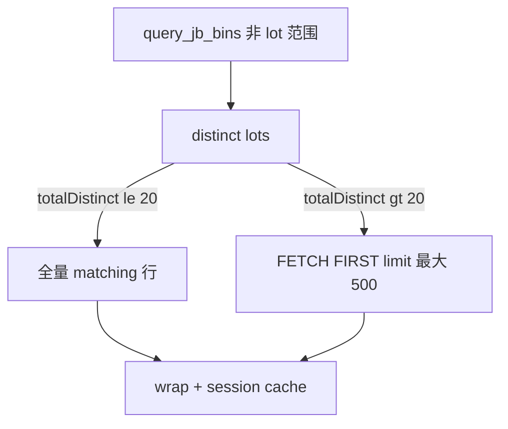

# Cursor / Claude Code 交接：Agent 列表工具 limit 上限 200→500

**日期：** 2026-07-20  
**读者：** Claude Code / Cursor 接手 Agent `query_jb_bins` / `query_yield_triggers` 行数上限、lot 列表覆盖、或误以为「limit 越大越好」时优先阅读。  
**前置：** [`HANDOFF_AGENT_JB_LOT_LISTING.md`](HANDOFF_AGENT_JB_LOT_LISTING.md)；同日 lot 列表富列修复（session cache / ≤20 lot 全量行）。

---

## 0. 一眼结论

| 项 | 状态 |
| --- | --- |
| Agent `query_jb_bins` / `query_yield_triggers` **max limit** | ✅ **500**（原 200） |
| **默认**未传 `limit` | 仍为 **50**（未改） |
| REST v3/v4 列表上限 | **不变**（仍为 `API_V3_LIST_LIMIT_MAX` / 2000） |
| 指定 `lot` 的 JB 查询 | 仍 **忽略 limit**，拉全量 matching 行 |
| lot 列表且 `totalDistinct ≤ 20` | 仍走 **全量 matching**（与 500 无关，优先于 limit） |
| 单一真相源常量 | `AGENT_TOOL_LIST_LIMIT_MAX`（[`agentToolListLimits.ts`](../pcr-ai-api/src/lib/agent/tools/agentToolListLimits.ts)） |

**不要**把「把 limit 提到 500」当成 lot 列表良率/卡号不全的主修复——那类问题靠 session cache + `JB_LISTING_FULL_ROWS_MAX_LOTS`；500 只改善 **lot 数 >20**、只能抽样 DETAIL 行时的覆盖。

---

## 1. 为什么改

- REST 列表早已允许远高于 200 的 Top-N；Agent 单独卡在 200，中等时间窗（近 3 个月、数十 lot）下 `lotYieldRankByTestEnd` / `binTotalsByLot` 覆盖偏少。
- 工具结果 JSON 在超 `toolResultMaxChars` 时本就会 **omit `rows`**，靠 session cache / 摘要字段；把 max 提到 500 **不会**线性放大发给模型的 JSON。
- Oracle 仍是 `FETCH FIRST :lim` Top-N（ROWID 管道），500 vs 200 ≈ 2.5× 传输；池默认 `poolMax=4`，可接受。

**刻意不做：** 默认 50→更高；提到 1000+（prompt 仍禁止）；用 500 替代 ≤20 lot 全量路径。

---

## 2. 改动清单（源码）

| 文件 | 改动 |
| --- | --- |
| [`agentToolListLimits.ts`](../pcr-ai-api/src/lib/agent/tools/agentToolListLimits.ts) | **单一真相源**：`AGENT_TOOL_LIST_LIMIT_DEFAULT=50`、`AGENT_TOOL_LIST_LIMIT_MAX=500`（handlers 再 export 兼容） |
| [`agentToolJbBins.ts`](../pcr-ai-api/src/lib/agent/tools/agentToolJbBins.ts) | clamp 用上述常量 |
| [`agentToolYieldTriggers.ts`](../pcr-ai-api/src/lib/agent/tools/agentToolYieldTriggers.ts) | 同上；`fetchYmRowsForCard` 亦用 MAX |
| [`agentToolValidator.ts`](../pcr-ai-api/src/lib/agent/agentToolValidator.ts) | 超限钳到 `AGENT_TOOL_LIST_LIMIT_MAX`（勿再写死 200） |
| [`agentToolSchemas.ts`](../pcr-ai-api/src/lib/agent/core/agentToolSchemas.ts) | schema 文案「最大 500」 |
| 直连 / scope / pending | `limit: 500`：`agentQueryScope`、`agentJbMaskScopeRoute`、`agentPendingQuery`、`agentSemanticDispatch`、`agentJbOverviewRoute` 等 |
| Prompt | `agentPrompt.ts`、`domainSection.ts`：推荐调用与「最大」文案同步为 500；仍禁止 1000 |
| 测试 | `agentToolValidator.test.ts`、`agentJbMaskScopeRoute.test.ts` |

---

## 3. 与「≤20 lot 全量行」的关系



- **≤20 lot**（如 device 最近一周 ~14 lot）：全量行 → 列表良率/卡/坏 bin 齐全；**不依赖** 500。
- **>20 lot**：用 limit（调用方现传 500）抽样；覆盖仍可能不全，应用 `aggregate_jb_bins` 或收窄时间窗。

常量：`JB_LISTING_FULL_ROWS_MAX_LOTS = 20`（`agentJbDistinctLots.ts`）。

---

## 4. 回归 / 验收

```bash
cd pcr-ai-api
npm run typecheck
npx tsx --test test/agentToolValidator.test.ts test/agentJbMaskScopeRoute.test.ts test/agentQueryScope.test.ts
```

真库（可选）：

1. `query_jb_bins(device, testEndFrom=近3个月, limit:500)` — 确认返回行数可 >200、耗时可接受。  
2. 模型传 `limit:1000` — validator 钳到 500。  
3. 复验「N49X 最近一周 lot+良品率」— 富列完整（主要靠全量行路径，非 500）。

---

## 5. 后续注意（给 Claude Code）

- **改上限只改一处常量** [`agentToolListLimits.ts`](../pcr-ai-api/src/lib/agent/tools/agentToolListLimits.ts) 的 `AGENT_TOOL_LIST_LIMIT_MAX`，并确认 validator / schema / 直连 args / prompt 一致。  
- **不要**在 prompt 写「最大 1000」或绕过 validator。  
- lot 列表缺列：先查 session cache（`cardIds` / `binTotalsByLot`）与 `shouldFetchFullRowsForListing`，再考虑动 limit。  
- Dummy 与 Oracle 共用同一 clamp；改行为后两边单测都要过（dummy-parity）。
