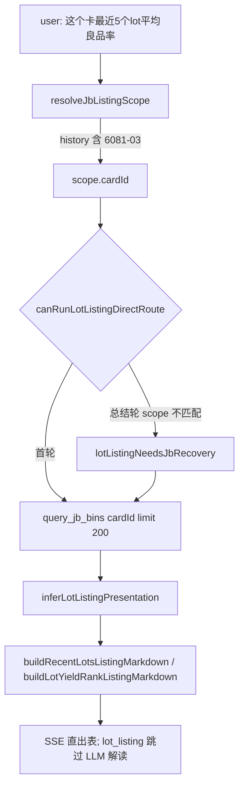

# Cursor 修复交接（2026-07-10 · Agent 探针卡 lot 列表 + 良率）

> **执行者：** Cursor Agent  
> **读者：** Claude Code / 后续 Cursor  
> **前置阅读：** [`HANDOFF_AGENT_JB_LOT_LISTING.md`](HANDOFF_AGENT_JB_LOT_LISTING.md)、[`HANDOFF_AGENT_JB_PROBE_CARD_CHANGE.md`](HANDOFF_AGENT_JB_PROBE_CARD_CHANGE.md)  
> **分支：** `main`  
> **设计原则：** **不做「打地鼠」**——不新增 `card_recent_lots_yield` 专用路由；统一 **scope 解析层** + 既有 **`lot_listing`** 呈现层。

---

## 0. 一眼结论

| 项 | 状态 | 说明 |
|---|---|---|
| **P0** 探针卡 follow-up 误查 device | ✅ 已修 | `resolveJbListingScope` 优先 `cardId`；「这个卡」从 history 继承 `6081-03` |
| **P0** 无良率 / 平均良率 | ✅ 已修 | `inferLotListingPresentation` + `buildLotYieldRankListingMarkdown` 在 `lot_listing` 直出 |
| **P1** LLM 误用 DeepSeek-V4-Pro | ✅ 已修 | `resolveAgentConfig` 强制 `deepseek-ai/DeepSeek-V4-Flash`（主/子模型） |
| **P1** 5 次 fan-out + `multiLotBail` 空表 | ✅ 已修 | `lot_listing` + `payloadCoversMultipleLots` 豁免 bail |
| **scope 恢复** LLM 查了错误参数 | ✅ 已修 | `lotListingNeedsJbRecovery` 比对 `jbListingScopeMatchesArgs` |
| **单元测试** | ✅ 78/78 相关通过 | `agentQueryScope` / `agentJbDeterministicReply` / `agentConfig` |
| **真库回归** | ⏭ 待做 | 部署后按 §5 复现 Desktop 三份 session 场景 |

---

## 1. 背景与症状（Desktop session 日志）

用户围绕探针卡 **6081-03** 的典型对话：

1. `6081-03 测试过什么 lot`
2. `列出这个卡最近测试的 5 个 lot 的评价 yield / 平均良品率`

| 症状 | 根因 |
|---|---|
| `query_jb_bins(device: WA01N39W)` 返回 **213** 个 device 级 lot | follow-up「这个卡」未解析 cardId；LLM 沿用 YM/JB 上下文里的 device |
| 回复无 yield%、无平均良率 | `lot_listing` 表默认只列 lot/device/时间，未识别「良率/平均」呈现需求 |
| 第三份日志使用 **DeepSeek-V4-Pro** | Settings / runtime 覆盖未强制 Flash |
| 用户要 5 个 lot 时 Agent 连查 5 次单 lot | 总结轮 `multiLotBail` 拦截多 lot payload，LLM 口述未出表的结论 |

**目标：** 卡级 lot 枚举与良率排名走 **一次** `query_jb_bins(cardId=…)`；表头标明 scope；可选 topN + 平均良率；模型固定 Flash。

---

## 2. 架构（统一 scope，非新路由）



### 2.1 Scope 层（单一真相源）

**文件：** `pcr-ai-api/src/lib/agent/agentQueryScope.ts`

| 符号 | 作用 |
|---|---|
| `inferCardIdFromText` | `\d{4}-\d{2,3}` 探针卡号 |
| `inferCardIdFromHistory` | 用户句 / assistant / tool_calls `cardId` / `probeCard` / `cardByPassId` |
| `isCardPronounQuestion` | 「这个卡 / 该卡 / 此卡」 |
| `resolveJbListingScope` | **优先级：** 句中 cardId → 指代卡+history → YM 工具上下文 → device/机台/mask/platform |
| `jbListingScopeToQueryArgs` | → `{ cardId?, device?, testerId?, …, limit: 200 }` |
| `jbListingScopeLabel` | 表头 `cardId=6081-03` 等 |
| `jbListingScopeMatchesArgs` | 上轮 `query_jb_bins` 是否与当前 scope 一致 |

**委托方：** `buildLotListingQueryArgs`、`buildJbScopeArgs`、`buildAggregateJbBinsScopeArgs` 均调用 `resolveJbListingScope`，避免 device/card 两套逻辑漂移。

### 2.2 路由层（复用 lot_listing）

**文件：** `pcr-ai-api/src/lib/agent/agentJbLotListingRoute.ts`

- `canRunLotListingDirectRoute`：`isLotListingQuestion` + `resolveJbListingScope != null`（**card-only scope 合法**）
- `lotListingNeedsJbRecovery`：末工具为 `query_jb_bins` 且 `!jbListingScopeMatchesArgs` → 重查正确 scope

**文件：** `pcr-ai-api/src/lib/agent/agentLoop.ts`

- 删除 `tryRunCardRecentLotsDirectRoute` / `agentJbCardRecentLotsRoute.ts`
- `emitDeterministicJbTablesReply` 注入 `scopeLabel` + `presentation`
- `multiLotBail`：`lot_listing && payloadCoversMultipleLots(payload)` 时 **不 bail**（修复 fan-out 后空表）

### 2.3 呈现层（scope 与 presentation 解耦）

**文件：** `pcr-ai-api/src/lib/agent/agentJbDeterministicReply.ts`

| 符号 | 作用 |
|---|---|
| `inferLotListingPresentation` | `topN`（`5个` / `top 5`）、`includeYield`、`includeAverageYield` |
| `buildLotYieldRankListingMarkdown` | 共用良率表（`lotYieldRankByTestEnd`） |
| `buildRecentLotsListingMarkdown` | yield 模式走 rank 表；否则原 JB+YM 合并列表 |
| `isLotListingQuestion` | 扩展「最近 N 个 lot + 良率/yield」 |

**刻意不做：** `card_recent_lots_yield` mode、`buildCardRecentLotsYieldMarkdown`、独立 card 路由文件。

### 2.4 模型锁定

**文件：** `pcr-ai-api/src/lib/agent/agentConfig.ts`

- `ALLOWED_AGENT_MODEL = deepseek-ai/DeepSeek-V4-Flash`
- `resolveAgentConfig`：`model` / `subAgentModel` **忽略** override 与 env，恒为 Flash

**文件：** `pcr-ai-api/src/lib/runtimeConfig.ts`、`pcr-ai-report/src/hooks/useServerConfig.ts` — 默认模型字符串同步为 Flash。

---

## 3. 关键行为变更

### 3.1 cardId 优先于 device

当 history 含 `6081-03`，用户问「列出这个卡最近 5 个 lot 平均良品率」：

```json
{ "cardId": "6081-03", "limit": 200 }
```

**不会**再发 `{ "device": "WA01N39W", "limit": 200 }`。

### 3.2 良率表列

`presentation.includeYield === true` 时输出：

| lot | device | 最差 (waferId / pass) | 良率% | 测试结束时间 |

`includeAverageYield` 时追加：**平均良率（上述 N 个 lot）：xx.xx%**

### 3.3 Recovery 路径

总结轮若 LLM 已调 `query_jb_bins` 但参数 scope 错误（有 device 无 cardId），`lotListingNeedsJbRecovery` 触发直连重查，与 YM→JB 补查并列。

---

## 4. 测试

```bash
cd pcr-ai-api
npm run typecheck
npx tsx --test test/agentQueryScope.test.ts test/agentJbDeterministicReply.test.ts test/agentConfig.test.ts
```

新增/更新用例：

- `resolveJbListingScope` card 优先于 history device
- `buildLotListingQueryArgs`「这个卡」→ `cardId: 6081-03`
- `buildRecentLotsListingMarkdown` yield presentation + 平均良率
- `canRunLotListingDirectRoute` card-scoped lot 列表
- `resolveAgentConfig` 强制 Flash

**注意：** 全量 `npm test` 在本地若 `runtime-config.json` 含 `jbDeterministicDispatch: true`，`agentLoop.test.ts` / `jbRouteResolver.test.ts` 的 flag-off 用例可能失败——与本次改动无关；CI 或隔离 `RUNTIME_CONFIG_PATH` 可复现绿。

---

## 5. 部署与真库回归

### 5.1 部署

```bash
cd pcr-ai-api
npm ci && npm run build && npm run pm2:reload
```

报表：Settings → 恢复默认（确保 UI 默认 Flash；服务端 `resolveAgentConfig` 已硬锁）。

### 5.2 Agent 复验脚本（6081-03）

**Turn 1**

```
6081-03 测试过什么 lot
```

期望：

- `tool_start` → `query_jb_bins`，args 含 **`cardId: "6081-03"`**，无 device
- 正文 Markdown 表，scope 标签含 `cardId=6081-03`
- lot 数量应为卡级规模，非 200+ device 枚举

**Turn 2**

```
列出这个卡最近测试的 5 个 lot 的评价 yield / 平均良品率
```

期望：

- 一次 `query_jb_bins(cardId)` 或 recovery 后同 scope
- 表含 **良率%** 列 + **平均良率** 脚注
- 最多 5 行 lot（按 TESTEND 降序或良率排序，见 `inferLotListingPresentation`）
- **非** 5 次单 lot `query_jb_bins` + 空 `multiLotBail`

**模型：** 日志 / Settings 均应显示 `deepseek-ai/DeepSeek-V4-Flash`。

---

## 6. 后续可选（未做）

| 项 | 说明 |
|---|---|
| `agentPrompt.ts` | 文档化「卡级 lot 列表用 `cardId` 不用 device」减少非直连路径 LLM 误参 |
| 真库 curl | `GET /api/v4/infcontrol-layer-bins?cardId=6081-03&limit=200` 核对 distinct lot 数 |
| 测试隔离 | `agentLoop.test.ts` flag-off 用例设 `RUNTIME_CONFIG_PATH` 临时文件 |

---

## 7. 变更文件清单

| 文件 | 变更 |
|---|---|
| `agentQueryScope.ts` | `resolveJbListingScope`、card 推断、scope 匹配 |
| `agentJbDeterministicReply.ts` | `LotListingPresentation`、共用良率表、扩展 `isLotListingQuestion` |
| `agentJbLotListingRoute.ts` | scope 驱动直连与 recovery |
| `agentLoop.ts` |  wiring + `multiLotBail` 豁免 |
| `agentPendingQuery.ts` | `canRunLotListingDirectRoute` 传 history |
| `agentConfig.ts` | Flash 强制 |
| `runtimeConfig.ts` | 默认模型 Flash |
| `useServerConfig.ts` | 前端默认 Flash |
| `test/agentQueryScope.test.ts` | card scope 用例 |
| `test/agentJbDeterministicReply.test.ts` | card lot+yield 用例 |
| `test/agentConfig.test.ts` | Flash 强制 |
| ~~`agentJbCardRecentLotsRoute.ts`~~ | **已删除** |
