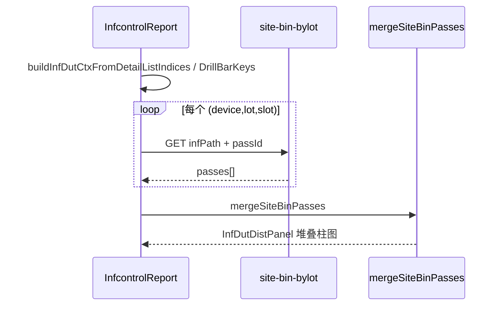

# JB 报表：BIN 筛选、Platform（Yield）、DUT 多选叠加 — 交接

**日期：** 2026-05-28  
**分支：** `feat/report-ux-dut-bin-agg`（与 `generate_chart` 修复同分支，部署时需整包 API + 报表）

**配套文档：**

| 文档 | 用途 |
| --- | --- |
| [`SITE_BIN_BY_LOT_INTEGRATION.md`](SITE_BIN_BY_LOT_INTEGRATION.md) | 单片 `infPath`、DUT 业务含义 |
| [`HANDOFF_SITE_BIN_BY_LOT_AGG.md`](HANDOFF_SITE_BIN_BY_LOT_AGG.md) | Lot/Device 级 INF 聚合（服务端 `mergeSiteBinByLotData`） |
| [`pcr-ai-api/docs/SITE_BIN_BY_LOT_API.md`](../pcr-ai-api/docs/SITE_BIN_BY_LOT_API.md) | `site-bin-bylot` curl / 参数 |

---

## 1. 给下一位的一句话

JB STAR 明细支持 **`bins=8,11,131`** 列表筛选；**Platform 机台大类** 只在 **Yield Monitor**（`HOSTNAME`）下拉，含 **93K**；JB 仍用 **Tester Type**。明细表与图表下钻（按 Slot）支持 **多选**，下方 DUT×BIN 图对多片 wafer **并行调 `site-bin-bylot` 后在浏览器按 pass×bin×dut 累加 dieCount**（与 API `mergeSiteBinByLotData` 规则一致）。

---

## 2. 功能一览

| 能力 | 报表 | API 查询参数 | DB 列 / 数据源 |
| --- | --- | --- | --- |
| BIN 列筛选 | JB STAR 查询区「BIN 编号」 | `bins=8,11,131` | `INFLAYERBINLIST.BINn`，`NVL(BINn,0)>0` |
| 旧式 BIN 精确值 | v1 仍支持 | `bin8=5,10` | `BIN8 IN (...)` die 数 |
| Platform | **Yield Monitor** 仅 | `platform=UFLEX` 等 | `HOSTNAME` REGEXP |
| Tester Type | JB STAR（原有） | `tstype` | `TSTYPE` |
| DUT 分布（单片） | 点明细行 / 下钻 Slot | `infPath` + `passId` | INF + Perl |
| DUT 分布（多片叠加） | 明细多选 + 下钻多选 | 每片一次 `infPath` | 前端 `mergeSiteBinPasses` |

---

## 3. BIN 筛选 `bins`

**语义：** `bins=8,11,131` → 行匹配若 **任意** 所列 `BINn` 列 die **> 0**（Oracle：`NVL(t2.BINn,0)>0 OR …`）。

| 模块 | 路径 |
| --- | --- |
| 解析 / SQL / Dummy | `pcr-ai-api/src/lib/infcontrolBinColumnFilters.ts` |
| v1 / v3 接入 | `infcontrolLayerBinFilters.ts`（`lb.` / `t2.`） |
| Dummy 行过滤 | `infcontrolLayerBinDummy.ts` → `rowMatchesInfcontrolBinColumnFilters` |
| 报表 | `InfcontrolReport.tsx` 查询区、`buildCoreParams` → `bins` |
| Manifest | `apiManifest.ts` v1 / v3 |
| 测试 | `test/infcontrolBinColumnFilters.test.ts`、`rest-api-v3-dummy.test.ts`（`bins=8`，断言 `bins[]` 非顶层 `BIN8`） |

**注意：** v3 列表响应行已 enrich，BIN 在 **`bins[]`**（`{ n, value, isGoodBin }`），无顶层 `BIN8`。

---

## 4. Platform（Yield only）

**产品：** JB 已有 **Tester Type**，不再放 Platform；Yield 用 **HOSTNAME** 机台大类。

| Platform | HOSTNAME / TESTERID 匹配规则 |
| --- | --- |
| UFLEX | 含 `uflex` |
| FLEX | 含 `flex` 且不含 `uflex` |
| PS16 / J750 / MST | 子串 `ps16` / `j750` / `mst` |
| **93K** | 子串 `93k` |

| 模块 | 路径 |
| --- | --- |
| 共享逻辑 | `pcr-ai-api/src/lib/testerPlatform.ts` |
| Yield v1 / v3 | `yieldMonitorTriggerFilters.ts` → `t.HOSTNAME` |
| Yield Dummy | `yieldMonitorTriggerDummy.ts` |
| 报表下拉 | `pcr-ai-report/src/utils/testerPlatform.ts`、`YieldMonitorReport.tsx` |
| 测试 | `test/testerPlatform.test.ts`、`rest-api-v3-dummy.test.ts`（`platform=UFLEX`） |

**JB infcontrol 已移除** `platform` 查询（`infcontrolLayerBinFilters.ts` / Dummy 无 platform 过滤）。

---

## 5. DUT 多选叠加（报表）

### 5.1 交互

| 入口 | 多选方式 | 约束 |
| --- | --- | --- |
| **明细表** | 复选框 + 表头全选；点行可切换 | 仅同一 **Device + LOT** |
| **图表下钻** | 下钻维度为 **Slot** 时，点击条形切换选中 | 查询区须填 **Lot** |

Pass 仍分 **Pass 1 / 3 / 5** 三张图；同一 pass 内 `bin×dut` dieCount **求和**。

### 5.2 数据流



| 模块 | 路径 |
| --- | --- |
| 选行 / 下钻上下文 | `pcr-ai-report/src/utils/infDutSelection.ts` |
| 前端合并 | `pcr-ai-report/src/utils/mergeSiteBinPasses.ts` |
| 多片请求 + 展示 | `InfDutDistPanel.tsx` |
| 明细多选 UI | `DataTable.tsx`（`multiSelect`） |
| 下钻多选 UI | `DrillDownPanel.tsx`（`multiSelect` + `selectedKeys`） |
| 报表编排 | `InfcontrolReport.tsx` |

### 5.3 与 Oracle / Dummy 的正确性

| 环境 | 行为 | 验证 |
| --- | --- | --- |
| **Oracle** | 每 `infPath` 独立 Perl 读 map；合并 = 真叠加 | `mergeSiteBinPasses` ≡ `mergeSiteBinByLotData`（单测） |
| **Dummy** | 原问题：多 `infPath` 返回**同一份** fixture → 重复计数 | 已修：`outputSiteBinByLotDummy.ts` 按路径 `r_1-{slot}` 对 dieCount **× slot**（lot 目录聚合仍 ×1） |
| **HTTP** | 两片 `infPath` 并行 fetch 后 merge | `test/siteBinMultiWaferHttpDummy.test.ts` |

**不校验** 叠加结果与 Oracle 明细 `BINn` 列之和（数据源不同，产品约定）。

---

## 6. 测试命令

```bash
cd pcr-ai-api
npm test
# 重点：
#   test/infcontrolBinColumnFilters.test.ts
#   test/infDutSelection.test.ts
#   test/siteBinMultiWaferHttpDummy.test.ts
#   test/testerPlatform.test.ts
#   test/rest-api-v3-dummy.test.ts

cd pcr-ai-report
npm run build
```

Oracle 真库 `site-bin-bylot` 多片 E2E：需 `PCR_AI_RUN_ORACLE_TESTS=1` 与可达 INF（CI 默认 skip）。

---

## 7. 部署与联调

1. **API**：`npm run build` 后 `pm2 reload`（或 dev `npm run dev`）。
2. **报表**：`npm run build` → `dist.tar` 到 nginx。
3. **Dummy 联调：** `INFCONTROL_LAYER_BINS_DUMMY=true` + `SITE_BIN_BY_LOT_DUMMY`（或 `NODE_ENV=test`）；JB 明细多选两片不同 Slot 时，Dummy DUT 图 die 数应随 slot 缩放（非简单翻倍同 fixture）。
4. **生产：** 多选需 API 能读对应 `{INF_STORAGE_ROOT}/{DEVICE}/{LOT}/r_1-{slot}`。

---

## 8. 已知限制 / 后续

- Agent 工具尚未暴露 `bins` / 多片 DUT 合并（报表专用）。
- 下钻非 **Slot** 维度时无法多选 DUT（设计如此）。
- Dummy slot 缩放仅为联调区分片号，**不等于** Oracle 真实 map 比例。

---

## 9. 变更文件清单（便于 code review）

**API：** `infcontrolBinColumnFilters.ts`、`infcontrolLayerBinFilters.ts`、`infcontrolLayerBinDummy.ts`、`testerPlatform.ts`、`yieldMonitorTriggerFilters.ts`、`yieldMonitorTriggerDummy.ts`、`buildInfPath.ts`（`parseInfWaferSlotFromPath`）、`outputSiteBinByLotDummy.ts`、`apiManifest.ts`、测试 4 个新文件 + `rest-api-v3-dummy.test.ts`。

**Report：** `InfcontrolReport.tsx`、`InfDutDistPanel.tsx`、`DataTable.*`、`DrillDownPanel.tsx`、`YieldMonitorReport.tsx`、`infDutSelection.ts`、`mergeSiteBinPasses.ts`、`testerPlatform.ts`、`AiAgentReport.tsx`（可重试错误文案）。
