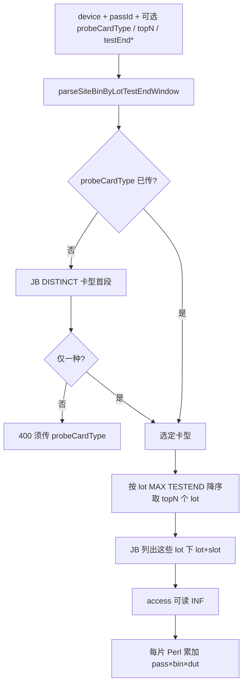

# site-bin-bylot Lot / Device 聚合 — Claude Code 交接

**日期：** 2026-05-25（含 `topN` 最新 lot、`TESTEND` 默认一年）  
**分支：** `feat/report-ux-dut-bin-agg`  
**REST：** `GET /api/v1/inf-analysis/site-bin-bylot`（亦 `/api/v3`、`/api/v4`）

**配套文档：**

| 文档 | 用途 |
| --- | --- |
| [`pcr-ai-api/docs/SITE_BIN_BY_LOT_API.md`](../pcr-ai-api/docs/SITE_BIN_BY_LOT_API.md) | curl / 参数 / 响应字段（§2.3–2.4） |
| [`SITE_BIN_BY_LOT_INTEGRATION.md`](SITE_BIN_BY_LOT_INTEGRATION.md) | 单片 wafer、报表 `InfDutDistPanel`、Agent 工具规划 |
| [`pcr-ai-api/CLAUDE.md`](../pcr-ai-api/CLAUDE.md) §6、§11.7 | API 包索引与近期纪要 |

---

## 1. 给下一位的一句话

在**不破坏单片 `infPath` 模式**的前提下，同一接口支持 **Lot** 与 **Device** 级 INF 累加。**Device 生产调用：** `device` + `passId`；默认在 JB 最近一年内取 **TESTEND 最新的 10 个 lot**（`topN`，最大 50），再对这些 lot 下可读 wafer 跑 Perl 并合并 `dieCount`。

---

## 2. 三种查询模式

| 模式 | 必填 query | 常用可选 | `meta.aggregateScope` | 说明 |
| --- | --- | --- | --- | --- |
| **单片** | `infPath`, `passId` | — | `wafer` | 报表 `InfDutDistPanel`；**勿与 device 同传** |
| **Lot** | `device`, `lot`, `passId` | `probeCardType` | `lot` | 无卡型：扫 lot 目录全部 `r_1-{slot}`；有卡型：JB 过滤后读 INF |
| **Device** | `device`, `passId` | `probeCardType`, `topN`, `testEnd*` | `device` | **勿传 `lot`**；见 §3 |

**INF 只读：** `readdir` / `access(R_OK)` + Perl `LoadINF`；无写删。  
**路径：** `{INF_STORAGE_ROOT}/{DEVICE}/{LOT}/r_1-{slot}`（`buildInfPath.ts`，默认根 `/data/INF`）。

---

## 3. Device 聚合算法（必读）



| 步骤 | 模块 | 说明 |
| --- | --- | --- |
| 时间窗 | `siteBinByLotTestEndWindow.ts` | 未传任何 `testStart*`/`testEnd*` → **UTC 最近一年** `lb.TESTEND`（与层控 v3 一致） |
| topN | `siteBinByLotDeviceTopN.ts` | 默认 **10**，query `topN`/`topn`，最大 **50** |
| 选 lot | `siteBinByLotWaferResolve.ts` → `recentLotsForDeviceFromOracle` / `recentLotsForDeviceFromDummy` | `GROUP BY lot`，`ORDER BY MAX(TESTEND) DESC`，`ROWNUM <= topN` |
| 选 wafer | 同上 → `resolveSiteBinWafersFromOracle` | `ic.LOT IN (selectedLots)` + 卡型 + passId |
| 聚合 | `outputSiteBinByLot.ts` → `runOutputSiteBinByLotForDevice` | `mergeSiteBinByLotData` |

**曾出现的问题：** 无时间窗、无 topN 时 Device 会命中 **全历史**（如 1352 片）→ `VALIDATION_ERROR` / `SITE_BIN_BY_LOT_MAX_WAFERS_DEVICE`（默认 100 **片 wafer**）。当前默认 **一年 + topN=10** 规避。

---

## 4. Device 查询参数

| 参数 | 默认 | 上限/规则 | 说明 |
| --- | --- | --- | --- |
| `device` | — | 必填 | 与 JB `DEVICE` 一致 |
| `passId` | — | 必填，可多个 | sort1/2/3 → 1/3/5 |
| `topN` / `topn` | **10** | **1–50** | 仅 Device；按 TESTEND 取最新 N 个 **lot** |
| `probeCardType` | 自动推断 | 多种卡型须显式传 | `CARDID` 首段，如 `8037` |
| `testEndFrom` / `testEndTo` 等 | 最近一年 | 与 v3 层控 8 个时间键同义 | 收窄 JB 候选池；见 `SITE_BIN_BY_LOT_API.md` |

**不要传 `lot`**（传了走 Lot 模式，不用 topN）。

---

## 5. 生产 URL（`10.192.130.89:30008`）

```text
# 默认：一年 TESTEND + topN=10 个最新 lot
http://10.192.130.89:30008/api/v4/inf-analysis/site-bin-bylot?device=WA03P02G&passId=1

# 最新 20 个 lot
http://10.192.130.89:30008/api/v4/inf-analysis/site-bin-bylot?device=WA03P02G&passId=1&topN=20

# 多种卡型时
http://10.192.130.89:30008/api/v4/inf-analysis/site-bin-bylot?device=WA03P02G&probeCardType=8037&passId=1

# Lot（无 topN）
http://10.192.130.89:30008/api/v4/inf-analysis/site-bin-bylot?device=WA03P02G&lot=NF12551.1N&passId=1

# 单片（报表）
http://10.192.130.89:30008/api/v4/inf-analysis/site-bin-bylot?infPath=/data/INF/WA03P02G/NF12551.1N/r_1-3&passId=3
```

---

## 6. 响应字段（聚合）

| 字段 | Device | Lot | 含义 |
| --- | --- | --- | --- |
| `passes[]` | ✓ | ✓ | `bin` / `duts[].dut` / `dieCount` |
| `meta.aggregateScope` | `device` | `lot` | |
| `probeCardType` | ✓ | 有 JB 时 | 传入或推断 |
| `topN` | ✓ | — | 请求的 lot 数上限 |
| `selectedLots` | ✓ | — | 按 TESTEND 选中的 lot（新→旧） |
| `waferLots` | ✓ | — | 实际读到 INF 的 lot 子集 |
| `waferCount` / `waferSlots` | ✓ | ✓ | 参与聚合的 wafer |
| `testEndWindow` | ✓ | JB 路径 | 实际 `TESTEND` 上下界 ISO |
| `testEndWindowDefaultOneYear` | 可能 true | 可能 true | 服务端注入默认一年 |
| `skippedInfPaths` | ✓ | ✓ | JB 命中但 INF 不可读 |

---

## 7. 源码索引

| 文件 | 职责 |
| --- | --- |
| `pcr-ai-api/src/routes/infAnalysisRoutes.ts` | 路由：wafer / lot / device；解析 `topN`、`testEndWindow` |
| `pcr-ai-api/src/lib/outputSiteBinByLot.ts` | Perl、`merge`、`runOutputSiteBinByLotForDevice/Lot*` |
| `pcr-ai-api/src/lib/siteBinByLotWaferResolve.ts` | JB wafer、top lot、`recentLotsForDevice*` |
| `pcr-ai-api/src/lib/siteBinByLotDeviceTopN.ts` | `parseSiteBinDeviceTopN`（默认 10，max 50） |
| `pcr-ai-api/src/lib/siteBinByLotTestEndWindow.ts` | `parseSiteBinByLotTestEndWindow`（默认一年） |
| `pcr-ai-api/src/lib/outputSiteBinByLotDummy.ts` | Dummy 聚合（须与 Oracle 逻辑同步） |
| `pcr-ai-api/src/lib/buildInfPath.ts` | INF 路径拼接 |
| `pcr-ai-api/src/perlscripts/output_site_bin_bylot.pl` | `PASS_TYPE='TEST'` |
| `pcr-ai-api/src/lib/apiManifest.ts` | OpenAPI 式 manifest |
| `pcr-ai-api/test/outputSiteBinByLot.test.ts` | 单元 + 路由测试 |

**环境变量：**

- `SITE_BIN_BY_LOT_MAX_WAFERS` — Lot，默认 **25**
- `SITE_BIN_BY_LOT_MAX_WAFERS_DEVICE` — Device 聚合后 **wafer 片数**，默认 **100**（env 硬顶 **500**）

---

## 8. 与报表 / Agent

| 场景 | 状态 |
| --- | --- |
| `InfDutDistPanel` | **已实现**，仅单片 `infPath` |
| Device/Lot 级报表图 | **未做** |
| Agent `query_inf_site_bin_by_dut` | **未改**（wafer 级）；Device 聚合可新工具 |

---

## 9. 修改后必跑与发布

```bash
cd pcr-ai-api
npm run typecheck
npx tsx --test test/outputSiteBinByLot.test.ts
npm run build   # 含 copy-perlscripts
# 生产机 pm2 reload 等
```

---

## 10. 交接检查清单

- [ ] 已读本文 + `SITE_BIN_BY_LOT_API.md` §2.3–2.4 + `pcr-ai-api/CLAUDE.md` §11.7
- [ ] Device 改动同步 **`siteBinByLotWaferResolve.ts`** + **`outputSiteBinByLotDummy.ts`**
- [ ] 改 query 语义时更新 **`apiManifest.ts`** 与本文 §4–5
- [ ] 未破坏 `infPath` 与 `InfDutDistPanel`
- [ ] `outputSiteBinByLot.test.ts` 通过

---

## 11. 变更纪要（Git）

| 提交 | 内容 |
| --- | --- |
| `14f2fbd` | Lot/Device 聚合 + 可选 `probeCardType` |
| `c7f1067` | Device 仅需 `device`+`passId`；JB 推断卡型 |
| `7c615e1` | Device 默认 TESTEND 最近一年（修 1352 片） |
| `3af0d11` | Device 默认 `topN=10` 最新 lot（`topN` max 50） |

---

*冲突以源码与 manifest 为准；改行为请同步更新本文与 `SITE_BIN_BY_LOT_API.md`。*
